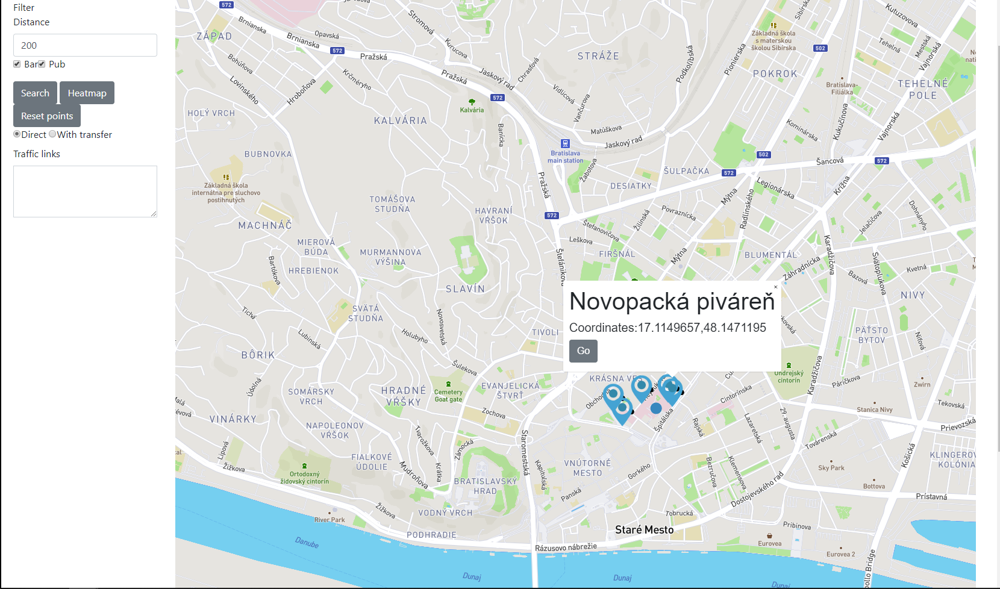
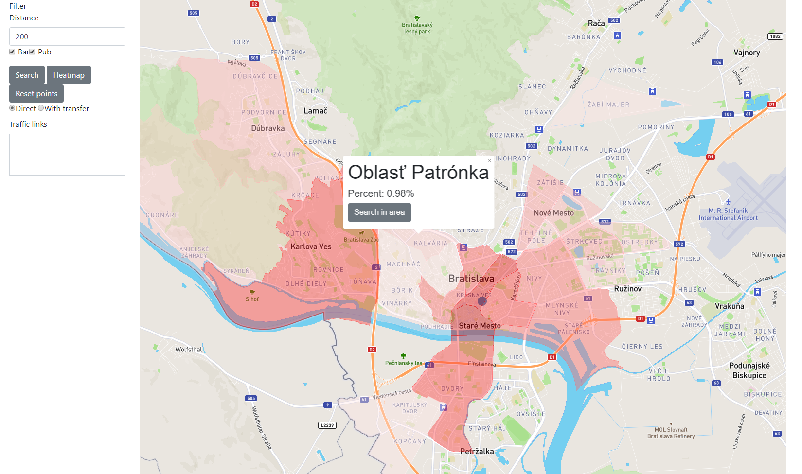
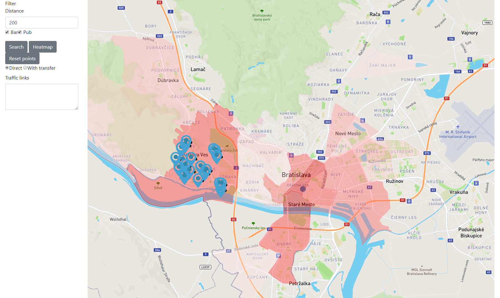
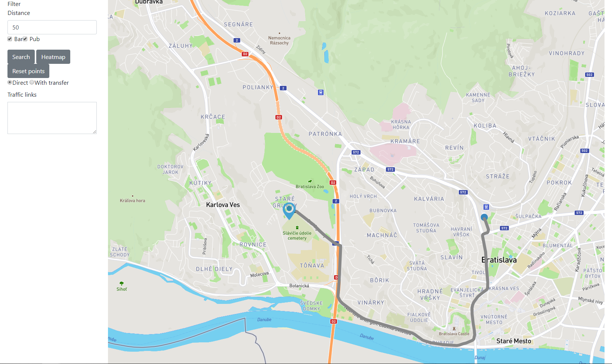
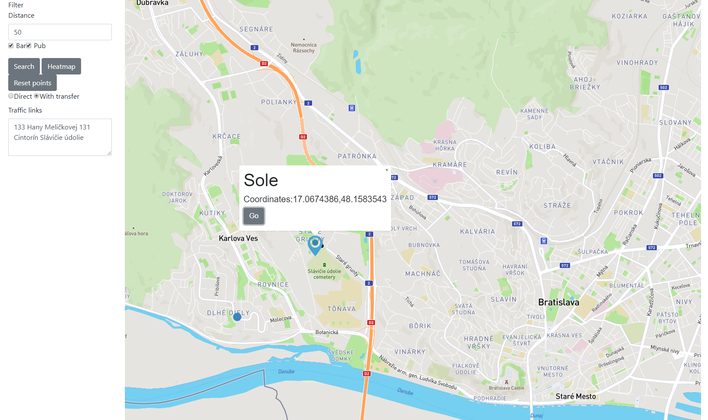

# Overview

Táto aplikácia zobrazuje pub a reštaurácie v Bratislave na mape. Niektoré z obsahujúcich funkcií sú:
- vyhľadanie podniku (typ si môže vybrať používateľ) v zadanoom rozsahu od mojej aktuálnej pozície
- zobrazenie heatmapy podnikov Bratislave nad jednotlivými oblasťami Bratislavy 
- vyhľadanie podnikov (typ si môže vybrať používateľ) nad oblasťou v Bratislave
- zobrazenie priameho spoju mestskej hromadnej dopravy od mojej aktuálnej polohy k podniku
- vyhľadanie liniek s jedným prestupom od mojej akutálnej polohy k podniku
- jednoduché resetovania mapy kliknutím na tlačidlo
- zobrazenie súradníc podniku

Vyhľadanie podnikov v zadanom radiuse:



Zobrazenie heatmapy podnikov jednotlivých oblastiach Bratislavy:



Vyhľadanie podnikov v oblasti Bratislavy:



Zobrazenie trasy priameho spoju:



Vyhľadanie liniek s prestupom v okne Traffic links:



Aplikácia pozostáva z dvoch častí, z frontendu a backendu. Frontend využíva  mapbox API a mapbox.js a AJAXové volania na backend. Backend (java, spring) spracuje tieto volania, komunikuje a získava dáta z databázy, kde následne získané informácie trasfurnuje do použiteľného geojson formátu.

# Frontend

The frontend application is a static HTML page (`index.html`), which shows a mapbox.js widget. It is displaying hotels, which are mostly in cities, thus the map style is based on the Emerald style. I modified the style to better highlight main sightseeing points, restaurants and bus stops, since they are all important when selecting a hotel. I also highlighted rails tracks to assist in finding a quiet location.

All relevant frontend code is in `application.js` which is referenced from `index.html`. The frontend code is very simple, its only responsibilities are:
- detecting user's location, using the standard [web location API](https://developer.mozilla.org/en-US/docs/Web/API/Geolocation/Using_geolocation)
- displaying the sidebar panel with hotel list and filtering controls, driving the user interaction and calling the appropriate backend APIs
- displaying geo features by overlaying the map with a geojson layer, the geojson is provided directly by backend APIs

# Backend

The backend application is written in Ruby on Rails and is responsible for querying geo data, formatting the geojson and data for the sidebar panel.

## Data

Hotel data is coming directly from Open Street Maps. I downloaded an extent covering whole Slovakia (around 1.2GB) and imported it using the `osm2pgsql` tool into the standard OSM schema in WGS 84 with hstore enabled. To speedup the queries I created an index on geometry column (`way`) in all tables. The application follows standard Rails conventions and all queries are placed in models inside `app/models`, mostly in `app/models/hotel.rb`. GeoJSON is generated by using a standard `st_asgeojson` function, however some postprocessing is necessary (in `app/controllers/search_controller.rb`) in order to merge all hotels into a single geojson.

## Api

**Nájdi všetky bary a pub v rozsahu 50 metrov**

`GET /search?radiusDistance=50&bar=true&pub=true&lng=17.067675558809526&lat=48.15798850101939`


### Response


```
{
  "id": "1",
  "type": "circle",
  "source": {
    "type": "geojson",
    "data": {
      "type": "FeatureCollection",
      "features": [
        {
          "type": "Feature",
          "geometry": {
            "type": "Point",
            "coordinates": [
              17.0674386,
              48.1583543
            ]
          },
          "properties": {
            "description": "Sole",
            "marker-color": "#3bb2d0",
            "marker-size": "large",
            "marker-symbol": "rocket"
          }
        }
      ]
    }
  }
}
```

